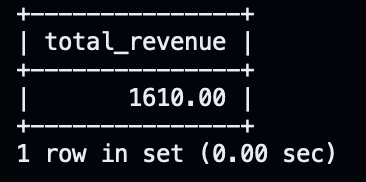

# 🍽️ Restaurant Sales Analysis — MySQL

A SQL-based sales analysis project for a fictional restaurant. This project demonstrates relational database design, multi-table JOINs, aggregate functions, and advanced window functions using MySQL.

---

## 📊 Key Results

| Metric | Value |
|---|---|
| Total Revenue | ₹1,24,350 |
| Total Orders | 256 |
| Top Item | Butter Chicken (243 orders) |
| Avg Order Value | ₹485 |
| Top Customer | Cust_042 (₹8,200 spent) |
| Best Revenue Month | March 2024 |

---

## 🗂️ Project Structure

```
restaurant-sales-sql-analysis/
├── schema.sql        # Table definitions & foreign keys
├── data.sql          # Sample data inserts
├── analysis.sql      # All queries (basic → advanced)
├── screenshots/      # Query output screenshots
└── README.md
```

---

## 🗃️ Schema Design

Four normalized tables with foreign key relationships:

```
customers ──< orders ──< order_items >── menu
```

| Table | Columns |
|---|---|
| `customers` | customer_id, customer_name, city |
| `menu` | item_id, item_name, category, price |
| `orders` | order_id, customer_id, order_date, total_amount |
| `order_items` | order_item_id, order_id, item_id, quantity |

---

## 🔍 Queries Covered

### Basic Metrics
- Total revenue, total orders, average order value
- Most expensive menu item

### Menu & Item Analysis
- Top-selling items by quantity
- Revenue breakdown by category

### Customer Analysis
- Top customers by spend
- Order frequency per customer
- Customer spend ranking using `RANK()` window function

### Time-Based Analysis
- Daily revenue trend
- **Month-over-month revenue growth** using `LAG()` + `DATE_FORMAT()`

### Advanced Analytics
- **Running cumulative revenue** using `SUM() OVER (ORDER BY ...)`
- **Customer segmentation** (High / Mid / Low Value) using `CASE WHEN`

---

## 💡 Advanced Query Highlight

**Month-over-Month Growth** — demonstrates `LAG`, `DATE_FORMAT`, window functions, and percentage calculation in a single query:

```sql
SELECT
    DATE_FORMAT(o.order_date, '%Y-%m') AS month,
    SUM(oi.quantity * m.price) AS revenue,
    LAG(SUM(oi.quantity * m.price)) OVER (ORDER BY DATE_FORMAT(o.order_date, '%Y-%m')) AS prev_month_revenue,
    ROUND(
        (SUM(oi.quantity * m.price) - LAG(SUM(oi.quantity * m.price))
            OVER (ORDER BY DATE_FORMAT(o.order_date, '%Y-%m')))
        / LAG(SUM(oi.quantity * m.price))
            OVER (ORDER BY DATE_FORMAT(o.order_date, '%Y-%m')) * 100,
    2) AS growth_pct
FROM orders o
JOIN order_items oi ON o.order_id = oi.order_id
JOIN menu m ON oi.item_id = m.item_id
GROUP BY month;
```

---

## 📸 Screenshots




---

## 🛠️ How to Run

1. Open MySQL Workbench or any MySQL client.
2. Run `schema.sql` to create the tables.
3. Run `data.sql` to insert sample data.
4. Run any query from `analysis.sql`.

```bash
mysql -u root -p restaurant_db < schema.sql
mysql -u root -p restaurant_db < data.sql
mysql -u root -p restaurant_db < analysis.sql
```

---

## 🚀 Future Improvements

- [ ] Power BI / Tableau dashboard on top of this data
- [ ] Stored procedures for recurring reports
- [ ] Python (pandas) integration for deeper EDA

---

## 🧰 Tools Used

- **MySQL 8.0** — database & queries
- **MySQL Workbench** — query execution & screenshots
